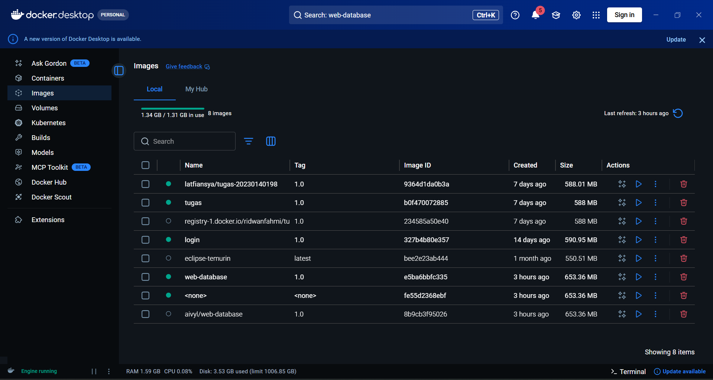
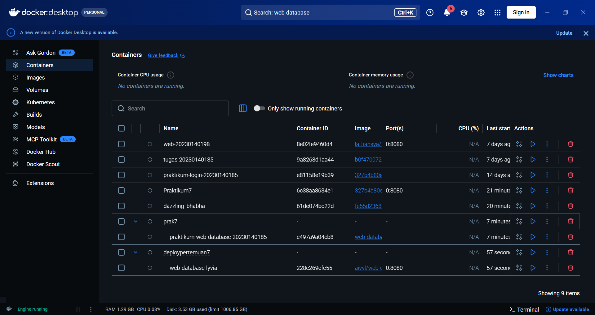
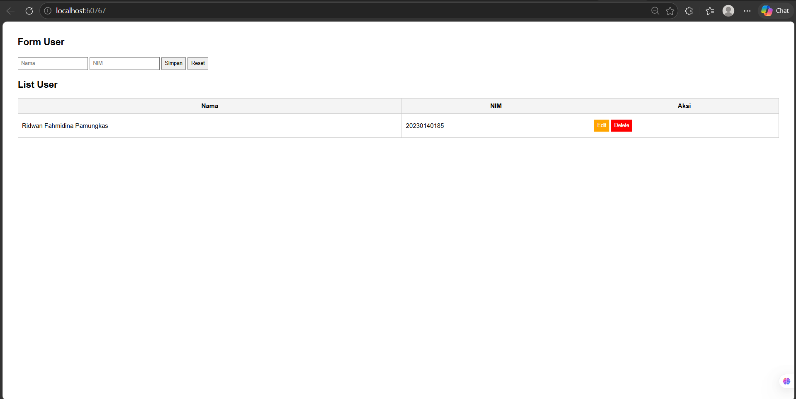
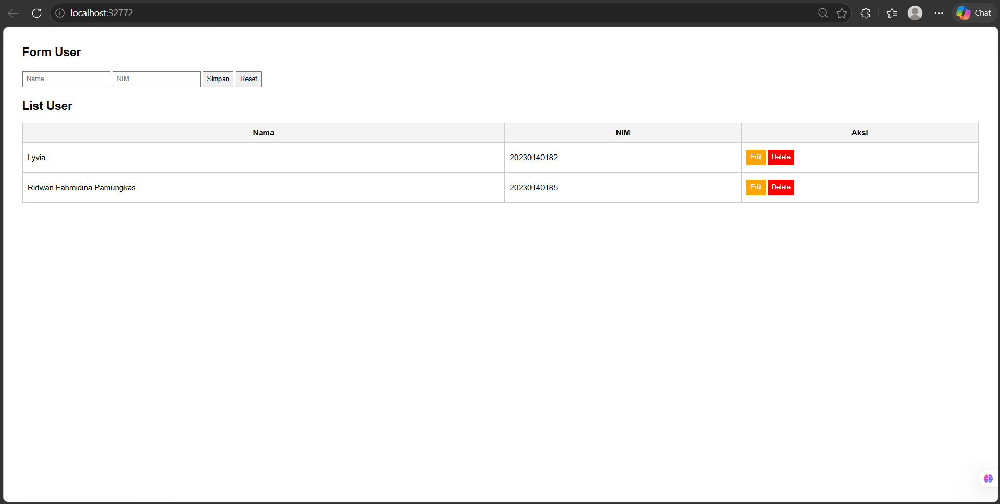

# Dokumentasi Tugas Docker - Pertemuan 7

Dokumentasi ini dibuat untuk memenuhi tugas mata kuliah berkaitan dengan penggunaan Docker Desktop, push/pull image, dan running container.

## 1. Halaman Image Docker Desktop
Halaman ini menampilkan daftar image di Docker Desktop setelah melakukan push image project sendiri dan pull image dari teman.

## 2. Halaman Container Docker Desktop
Halaman ini menampilkan daftar container yang sedang berjalan, termasuk container yang dibuat dari image teman yang telah di-pull.

## 3. Halaman Web Project Sendiri
Halaman form aplikasi project sendiri yang dijalankan melalui Docker. Tabel telah diisi dengan nama masing-masing.

## 4. Halaman Web Project Teman
Halaman form aplikasi milik teman yang dijalankan melalui Docker (hasil pull). Tabel telah diisi dengan nama masing-masing.

